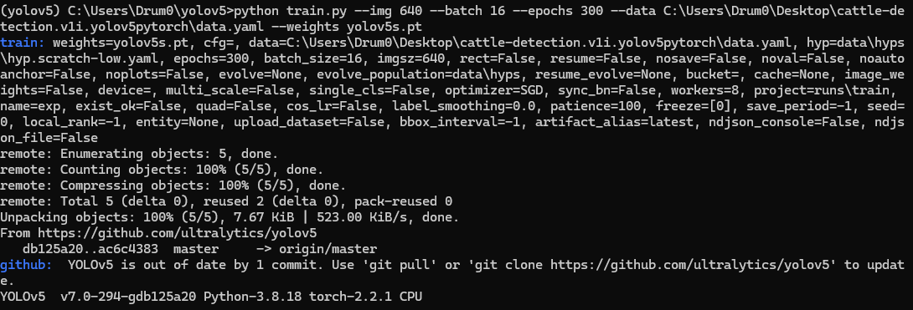

# LiveStock Monitoring System with Behavioural Analysis

I am currently working on my final year project, where I am applying Computer Vision and training You Only Look Once (YOLO) models to monitor livestock and analyse their behaviour. The objective is to develop a reliable system capable of detecting various behaviors in different environments to assist in better management and care. I am training and evaluating the performance and accuracy of two versions of the YOLO object detection models: YOLOv5 and YOLOv7. This system aims to provide insights into livestock health and behavior, facilitating proactive management and improved welfare practices.

# Setup/What you will need
- Conda Enviroment

- Python 3.8 or later

# Clone the YOLOv5 Repository

- !git clone https://github.com/ultralytics/yolov5
  
- %cd yolov5
  
- %pip install -r requirements.txt
  
# How To Train Your Model

To train a YOLO model using your dataset, follow this command template. Substitute the placeholders with the specific location of your dataset, the model weights file you want to use, the desired number of training epochs.

- python train.py --img 640 --batch (ENTER BATCH SIZE - 16 IS RECOMMENDED) --epochs (ENTER NUMBER OF EPOCHS YOU WANT TO TRAIN) --data (LINK TO YOUR DATA.YAML FILE) --weights yolov5s.pt

  

# How To Detect
Once the model is successfully trained, you can apply the trained weights to detect objects in new images or videos. To do this, follow the detect command below.

-python detect.py --weights best.pt --img 640 --conf 0.25 --source (/path/to/images_or_video)
